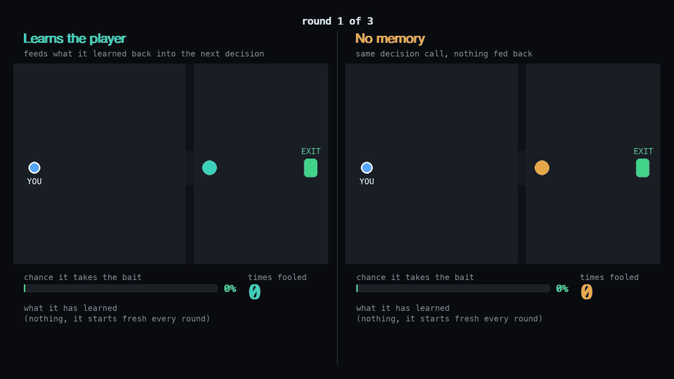

# Instinct

Instinct is a decision layer for game NPCs. Instead of hand-written behavior
trees or a slow LLM call per turn, an NPC's next move is a typed judgment over
the current game state: given what it senses and a fixed set of options, return a
pick, a probability distribution, and a confidence. That's cheap and fast enough
to run inside the game loop.

The second half is a learning loop. What an NPC observes about a player gets
distilled and fed back into the state it judges on, so the same judgment adapts
to that player, no retraining and no new model. A trick that fools a guard once
stops working once the guard has seen it.



*Both guards make the same decision call when you throw a distraction. Only the left one feeds what happened back into its state.*

Under the hood it uses TypeSafe for the typed judgments, W&B Weave to trace every
decision, and marimo to tune judgments live.

This repo is the Stealth slice: a small, local stealth game whose guards decide
what to do through that runtime, and learn the player's tricks across attempts.
See `BUILD.md` for the design and build order.

## Setup

Needs Python 3.10+ (a `typesafe-sdk` requirement).

You'll need a TypeSafe API key to run the games. Jev is in early access, so keys
come through the waitlist at [typesafe.ai](https://typesafe.ai). The W&B key is used
for Weave tracing and the LLM baseline.

```
python3.12 -m venv .venv && source .venv/bin/activate
pip install -r requirements.txt
cp .env.example .env      # then fill in your keys, never commit .env
```

## Run

```
python -m games.stealth.game      # the game
python -m games.stealth.learn     # the learning loop: one guard adapts, one doesn't
marimo edit tuning/stealth_tuning.py   # tune the guard's judgment and watch it change live
```

## Layout

- `runtime/`: shared, game-agnostic: judgments, baseline arm, memory, tracing, config
- `games/stealth/`: the game, its judgment, and golden eval cases
- `evals/`: placeholder for the eval harness (not built yet)
- `tuning/`: marimo tuning notebook

Keys live in `.env` (gitignored). Nothing here gets deployed; it runs locally.
