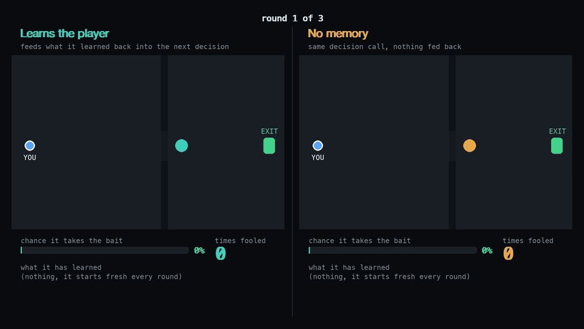

# Instinct

[](https://github.com/productlayers/instinct/actions/workflows/tests.yml)

NPCs that learn how each player plays, fast and cheap enough to run inside a game
loop. Instinct is a Python library built on TypeSafe's Jev.

It works for any NPC decision in a Python game, not just stealth: an enemy picking a
tactic, a shopkeeper setting a price, a companion deciding whether to follow you. It
works with pygame, Arcade, Ren'Py, or plain Python.



*Both guards decide through the same `Brain`. The left one calls `brain.learn()` after it
gets fooled. The right one never does.*

## Why

Scripted NPCs are cheap but predictable. LLM-driven NPCs are more interesting, but every
decision is slow and costly, and the answer comes back as text you have to parse. Neither
learns from the player.

Instinct sends Jev the NPC's situation, the actions it's allowed to take, and what's been
learned about this player. Jev returns a probability for each action, usually in 100 to
200 ms. When the player gets away with something, the game records a lesson, and every NPC
facing that player uses it from the next decision on.

## Install

```
pip install git+https://github.com/productlayers/instinct
export TYPESAFE_API_KEY=...     # Jev is in early access: typesafe.ai
```

Needs Python 3.10+.

## What you provide

- The actions the NPC can take, each with a plain-English description
- A sentence of instructions
- The situation, as any JSON-serializable dict
- An id for the NPC and one for the player

## Add it to your game

```python
from instinct import Brain

brain = Brain(
    actions={
        "investigate": "go check the noise",
        "hold": "stay at the post",
        "chase": "chase the player",
    },
    instructions="Decide what this guard does. If the noise matches a trick this "
                 "player is known to use, don't fall for it.",
    fallback="hold",            # used when Jev is slow, down, or unsure
    memory="npc_memory.db",     # lessons survive restarts
)

# when something happens near a guard (returns immediately)
brain.request("guard_1", player="p1", situation={"just_noticed": ["a clang to the east"]})

# each frame, until the decision is ready
if (d := brain.poll("guard_1")):
    guard.do(d.action)          # also: d.probabilities, d.fell_back, d.latency_ms

# when the player gets away with something
brain.learn("p1", "throws objects to lure guards off their post")
```

For a turn-based game or a script, `brain.decide(...)` blocks and returns the decision.
For an async game, use `await brain.adecide(...)`.

The same thing for a shopkeeper:

```python
shop = Brain(
    actions={
        "normal_price": "sell at the usual price",
        "discount": "offer 20% off",
        "charge_more": "raise the price",
    },
    instructions="Decide how this shopkeeper prices the item for this customer, "
                 "using what's known about them.",
    fallback="normal_price",
)
situation = {"item": "healing potion", "stock": 2, "customer_gold": 340}

shop.decide("merchant", player="p1", situation=situation)   # normal_price (about 1.0)
shop.learn("p1", "walks away when haggling fails, then comes back and pays full price")
shop.decide("merchant", player="p1", situation=situation)   # charge_more (about 0.7)
```

The comments show what Jev returned in three live runs of each call.

## What makes it safe to ship

| Guarantee | How | Tested in |
|---|---|---|
| Never stalls the game loop | `request()` returns right away. The call runs on a background thread and `poll()` picks up the result | `test_request_does_not_block_the_game_loop` |
| Keeps working when Jev is slow or down | Hard timeout (`timeout_s`, default 1s). On a timeout or error the NPC gets the `fallback` action. `d.reason` says why, and for errors `d.error` has the message, which is also logged once | `test_slow_jev_falls_back_instead_of_stalling`, `test_jev_error_falls_back`, `test_errors_say_what_went_wrong_and_log_once` |
| No flip-flopping on unsure calls | If the chosen action's probability is under `confidence_floor` (default 0.4), the NPC keeps its last action | `test_low_confidence_keeps_the_last_action` |
| Only actions you allowed | An action you didn't offer counts as an error and falls back | `test_unknown_action_from_decider_falls_back` |
| Learning survives restarts | Lessons are stored in SQLite | `test_learning_survives_a_restart` |
| One NPC's lesson reaches all of them | Lessons are stored per player, not per NPC | `test_one_npcs_lesson_reaches_every_npc` |
| Bad setup fails early with a clear message | Config is checked when you create the `Brain`, inputs when you call it | `test_bad_config_fails_fast`, `test_bad_input_fails_fast`, `test_missing_key_is_a_clear_error` |
| You can see what it's doing | `brain.stats()` returns decision counts, fallbacks by reason, and p50/p95 latency. `trace=True` logs every decision to W&B Weave | `test_stats_count_fallbacks` |

The tests replace Jev with a fake, so they run without an API key: `pytest -q`.

## Numbers from the demo

Headless runs of the learning demo, 6 rounds each, against live Jev:

| Run | Guard that learns | Guard with no memory | Decisions |
|---|---|---|---|
| Fresh start | fooled once | fooled 6 times | 12 from Jev, p50 131 ms, p95 181 ms |
| Restart with the same memory file | fooled 0 times | fooled 6 times | 12 from Jev |
| Jev timeout set to 1 ms | kept running, held its post | kept running, held its post | 12 of 12 fell back |

These are single runs, not a benchmark.

## Run the demo

```
python3.12 -m venv .venv && source .venv/bin/activate
pip install -r requirements.txt && pip install -e ".[dev]"
cp .env.example .env                                   # add your TYPESAFE_API_KEY

python -m games.stealth.learn                          # the side-by-side above
python -m games.stealth.learn --memory demo.db         # run it twice: the second run already knows the trick
python -m games.stealth.learn --timeout 0.001          # Jev "too slow": every decision falls back, the game keeps going
python -m games.stealth.game                           # the playable stealth level
```

The W&B key in `.env` is only used for Weave tracing and the LLM baseline.

## Limits and what's next

- Python only for now. The same `Brain` can sit behind an HTTP API so Unity, Unreal, and
  Godot games can call it. That's the next step.
- SQLite works for a single game server. Several servers sharing lessons need a shared
  store like Postgres. `LessonStore` is the piece to swap.
- Lessons are plain text that the game writes. Nothing summarizes what happened on its own
  yet.
- Not load-tested. The numbers above come from the demo.
- The eval harness in `evals/` isn't built yet. Golden cases are in `games/stealth/eval_cases.py`.

## Layout

- `instinct/`: the library (`Brain`, the lesson store, the Jev decider)
- `tests/`: library tests, no API key needed
- `games/stealth/`: the playable level and the learning demo (`learn.py` runs on the library)
- `runtime/`: the first prototype runtime, still used by the playable level, plus the LLM baseline
- `tuning/`: marimo notebook for tuning the guard's decision
- `docs/`: the demo clip

Keys live in `.env`, which is gitignored.
